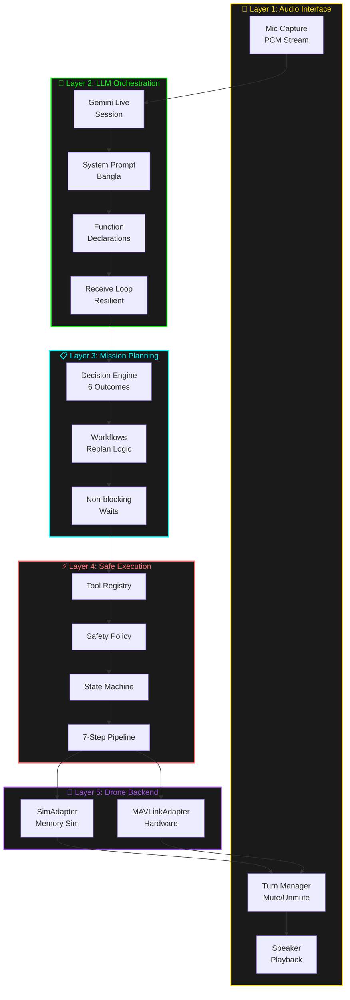
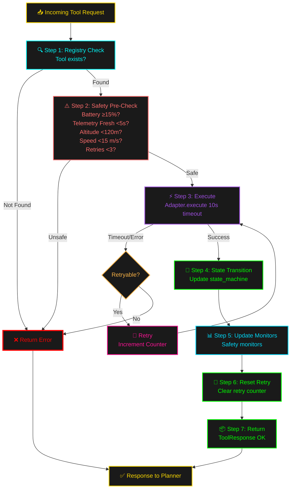
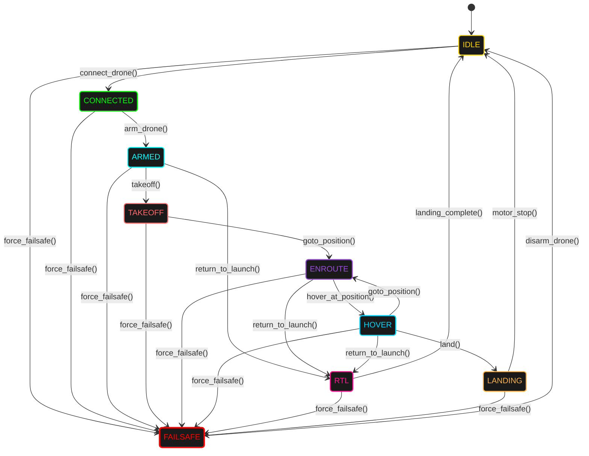
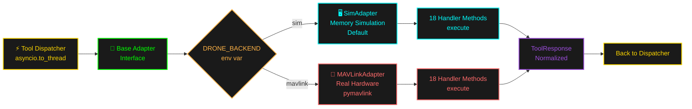

# CLAUDE.md

This file provides guidance to Claude Code (claude.ai/code) when working with code in this repository.

## Project Overview

**DroneAI (RayeedAI — রাইদ-এআই)** is a voice-controlled autonomous drone assistant using Python and the Google Gemini Live API. It accepts natural language voice commands in **Bangla** and translates them into drone flight operations. The system runs entirely async and supports a simulated drone backend (default) or real drone hardware via MAVLink.

## Commands

```bash
# Install dependencies
pip install -r requirements.txt

# Run with simulated drone (default)
python app.py

# Run with real drone via MAVLink
DRONE_BACKEND=mavlink MAVLINK_URI=udp:192.168.1.10:14550 python app.py

# Run all tests
pytest

# Run a single test file
pytest tests/test_state_machine.py -v

# Run tests with async support
pytest tests/test_failures.py -v
```

## Architecture

The system is a **five-layer pipeline**:

```mermaid
graph LR
    A["🎤 Voice Input"] -->|PCM Audio| B["🤖 Gemini Live API"]
    B -->|Parsed Intent| C["📋 Planner"]
    C -->|Decision: CONTINUE/WAIT/RETRY/REPLAN/ABORT/FAILSAFE| D["⚡ Tool Dispatcher"]
    D -->|Execute Tool| E["🚁 Drone Adapter"]
    E -->|Telemetry| F["📊 State Machine"]
    F -.->|State Update| D
    
    style A fill:#1a1a1a,stroke:#FFD700,stroke-width:3px,color:#FFD700
    style B fill:#1a1a1a,stroke:#00FF00,stroke-width:3px,color:#00FF00
    style C fill:#1a1a1a,stroke:#00FFFF,stroke-width:3px,color:#00FFFF
    style D fill:#1a1a1a,stroke:#FF6B6B,stroke-width:3px,color:#FF6B6B
    style E fill:#1a1a1a,stroke:#9D4EDD,stroke-width:3px,color:#9D4EDD
    style F fill:#1a1a1a,stroke:#00D9FF,stroke-width:3px,color:#00D9FF
```



### Layer Responsibilities

1. **Audio Interface** (`audio/`) — Mic capture → PCM → Gemini; speaker playback. `turn_manager.py` mutes mic while AI is speaking.

2. **LLM Orchestration** (`app.py` + `tools/declarations.py`) — Manages the Gemini Live session, system prompt (Bangla), function declarations, and the resilient receive loop. Session tasks (mic, send, receive, playback) are isolated from background tasks (telemetry, battery, position) so a crash in one doesn't kill the other.

3. **Mission Planning** (`planner.py` + `workflows/`) — Decision engine with 6 outcomes: `CONTINUE`, `WAIT`, `RETRY`, `REPLAN`, `ABORT`, `FAILSAFE`. The planner has **authority to override LLM decisions** for safety. Non-blocking waits allow audio/telemetry to continue during motor spin-up or altitude stabilization.

4. **Safe Execution** (`tool_dispatcher.py` + `safety_policy.py` + `state_machine.py`) — 7-step pipeline: registry check → safety pre-check → execute (10s timeout) → state transition → update monitors → reset retry counter → return `ToolResponse`. Safety gates block operations on low battery, stale telemetry, altitude/speed violations, or exceeded retry counts.

5. **Drone Backend** (`adapters/`) — Swappable via `DRONE_BACKEND` env var. `SimAdapter` (default) simulates all operations in memory. `MAVLinkAdapter` connects to real hardware.

#### Layer Interaction Diagram



### Key Files

| File | Role |
|---|---|
| `app.py` | Entry point; `DroneAI` class; Gemini Live session management |
| `state_machine.py` | Mission states (IDLE→CONNECTED→ARMED→TAKEOFF→ENROUTE→HOVER→LANDING→RTL→FAILSAFE) and legal transition graph |
| `tool_dispatcher.py` | Central 7-step execution pipeline for all drone commands |
| `safety_policy.py` | Pre-execution gates: battery, telemetry freshness, altitude ceiling, speed, retry limits |
| `planner.py` | Decision engine; overrides LLM `next_action`; schedules non-blocking waits |
| `tool_registry.py` | Metadata for 25+ tools: description, arg schema, permission level, allowed states |
| `schemas.py` | `ToolResponse` envelope (ok, tool, state, data, error, next_action, wait, confidence, timestamp) |
| `config.py` | All thresholds and env vars (API key, audio rates, backend, safety limits) |

### Tool Execution Flow

Every drone command goes through `tool_dispatcher.py`:



1. Registry check (tool exists?)
2. Safety pre-check (battery ≥15%, telemetry fresh <5s, altitude <120m, speed <15 m/s, retries <3)
3. Execute via adapter (10s timeout)
4. State machine transition
5. Update safety monitors
6. Reset retry counter on success
7. Return normalized `ToolResponse`

### State Machine Rules

- `force_failsafe()` is always allowed from any state
- Tools declare which states they are valid in (e.g., `takeoff` only in `ARMED`)
- `is_airborne()` covers TAKEOFF, ENROUTE, HOVER, LANDING, RTL

#### Mission State Flow



### Backend Abstraction

Both adapters implement the same interface from `adapters/base_adapter.py`. Switching between sim and MAVLink requires only an env var change — no code changes.



## MAVLink Adapter Implementation

The stub lives at `adapters/mavlink_adapter.py`. All 18 `_handle_*()` methods exist but return `{"error": "MAVLink not yet wired..."}`. The `SimAdapter` at `adapters/sim_adapter.py` is the reference implementation — match its structure exactly.

### Dependency
`pymavlink` is **not in `requirements.txt`** — add it before implementing:
```bash
pip install pymavlink
# then add "pymavlink" to requirements.txt
```

### Execution Model
All handler methods must remain **synchronous**. The dispatcher wraps every `adapter.execute()` call with `asyncio.to_thread()`, so blocking pymavlink calls (e.g., `wait_heartbeat()`, `recv_match()`) are safe inside handlers.

### Connection Pattern
```python
from pymavlink import mavutil
self._conn = mavutil.mavlink_connection(self._connection_string)
self._conn.wait_heartbeat()
```

### Required Handler Return Shapes
The dispatcher, planner, and safety policy read specific fields from these dicts — field names must match exactly:

| Handler | Must Return |
|---|---|
| `_handle_connect_drone` | `{"status": "connected", "connection_string": str}` |
| `_handle_get_telemetry` | `{"altitude": float, "airspeed": float, "groundspeed": float, "heading": float}` |
| `_handle_get_position_str` | `{"position": "Lat: X, Lon: X, Alt: X"}` |
| `_handle_get_battery` | `{"voltage": float, "current": float, "level_percent": float}` |
| `_handle_get_current_state` | `{"mode": str, "armed": bool, "system_status": str}` |
| `_handle_get_distance_to_str` | `{"distance_str": str, "bearing": float}` |
| `_handle_set_mode` | `{"status": "ok", "mode": str}` |
| `_handle_arm_drone` | `{"status": "armed"}` |
| `_handle_disarm_drone` | `{"status": "disarmed"}` |
| `_handle_takeoff` | `{"status": "taking_off", "target_altitude": float}` |
| `_handle_land` | `{"status": "landing"}` |
| `_handle_return_to_launch` | `{"status": "returning_to_launch"}` |
| `_handle_goto_position` | `{"status": "moving", "target": {"lat": float, "lon": float, "alt": float}}` |
| `_handle_set_yaw` | `{"status": "ok", "yaw_deg": float}` |
| `_handle_set_speed` | `{"status": "ok", "speed_ms": float}` |
| `_handle_wait_altitude` | `{"status": "altitude_reached", "altitude": float}` |
| `_handle_wait_arrival` | `{"status": "arrived"}` |
| `_handle_wait_time` | `{"status": "done", "waited_seconds": float}` |

On any failure, return `{"error": "<description>"}` — the dispatcher treats this as a retryable error and increments the retry counter.

> **Critical**: `safety_policy.py` reads `level_percent` (not `percent` or `battery_pct`) from the `get_battery` response to enforce battery thresholds. This field name is non-negotiable.

### Testing the Adapter
Mirror `tests/test_tools.py` — it covers all 18 handlers for `SimAdapter` and is the template for MAVLink tests. Adapter tests are **not async** (the `asyncio.to_thread` wrapping is the dispatcher's job):

```python
@pytest.fixture
def mav():
    adapter = MAVLinkAdapter("udp:127.0.0.1:14550")
    # mock self._conn if testing without hardware
    return adapter

def test_get_battery_shape(mav):
    result = mav.execute("get_battery", {})
    assert "level_percent" in result  # must match — safety_policy reads this key
    assert "voltage" in result
```

## Configuration (`config.py`)

Key env vars:
- `GEMINI_API_KEY` — Gemini API key
- `DRONE_BACKEND` — `"sim"` (default) or `"mavlink"`
- `MAVLINK_URI` — MAVLink connection string (default: `udp:127.0.0.1:14550`)

Safety thresholds (all configurable):
- Battery critical: 15% → failsafe; Battery low: 25% → warn
- Altitude ceiling: 120m
- Max speed: 15 m/s
- Telemetry stale: 5s → wait; 10s → emergency failsafe
- Max retries: 3

## Testing

Framework: `pytest` + `pytest-asyncio`. All test files are in `tests/`. Each major subsystem has its own test file covering normal paths, error/retry paths, and state transitions.
