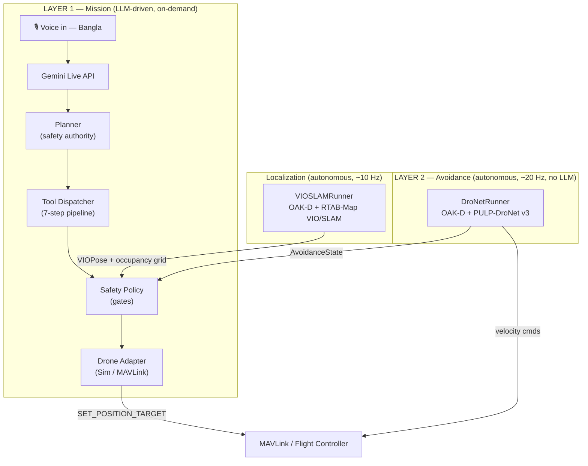
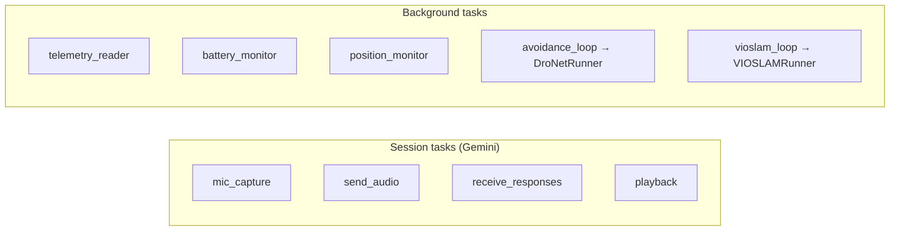
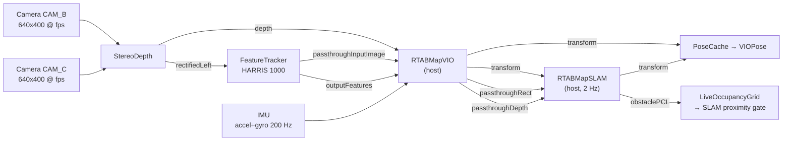
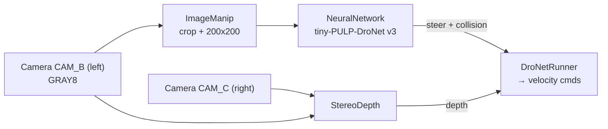

# DroneAI — RayeedAI (রাইদ-এআই)

A voice-controlled autonomous drone assistant. It listens to natural-language
flight commands in **Bangla** through the Google **Gemini Live API**, plans and
safety-checks every action, and drives either a simulated backend (default) or
real hardware over **MAVLink**. On-board an **OAK-D Lite** (DepthAI v3) it also
runs autonomous obstacle avoidance and VIO+SLAM localization — independently of
the language model.

The system is fully asynchronous: a crash in any one task cannot take down the
others.

---

## System map

Two **independent command layers** sit on top of a five-layer pipeline. In
ArduPilot `GUIDED` mode the avoidance layer's velocity commands are ephemeral
(they override the position setpoint for one cycle), so both layers coexist.



### Pipeline layers

| # | Layer | Location | Role |
|---|-------|----------|------|
| 1 | Audio interface | `audio/` | Mic → PCM → Gemini; speaker playback; mutes mic while the AI speaks |
| 2 | LLM orchestration | `app.py` + `tools/declarations.py` | Gemini Live session, Bangla system prompt, function declarations, resilient receive loop |
| 3 | Mission planning | `planner.py` + `workflows/` | Deterministic decision engine: `CONTINUE / WAIT / RETRY / REPLAN / ABORT / FAILSAFE`; overrides the LLM for safety |
| 4 | Safe execution | `tool_dispatcher.py` + `safety_policy.py` + `state_machine.py` | 7-step execution pipeline behind safety gates |
| 5 | Drone backend | `adapters/` | Swappable via `DRONE_BACKEND`: `SimAdapter` (default) or `MAVLinkAdapter` |
| 6 | Avoidance | `vision/avoidance/` | `DroNetRunner` — 20 Hz collision avoidance, sends velocity directly over MAVLink |
| 7 | VIO / SLAM | `localization/vio_slam/` | `VIOSLAMRunner` — 6-DOF pose + 3D occupancy grid for a SLAM-proximity gate |
| 8 | Memory | `memory/` | Crash-recovery mission state + persistent spatial knowledge |

---

## Async task map (the runtime "nodes")

`app.py` runs **nine** cooperating asyncio tasks. Session tasks are isolated
from background tasks so a failure in one group never kills the other.



| Task | Driver | Purpose |
|------|--------|---------|
| `mic_capture` | `audio/mic_capture.py` | Capture mic PCM, gated by `turn_manager` |
| `send_audio` | `app.py` | Stream audio to Gemini |
| `receive_responses` | `app.py` | Receive Gemini turns, dispatch tool calls, apply planner decisions |
| `playback` | `audio/playback.py` | Play AI speech |
| `telemetry_reader` | `telemetry/telemetry_reader.py` | Poll altitude / airspeed / heading |
| `battery_monitor` | `telemetry/battery_monitor.py` | Poll battery; drives low/critical gates |
| `position_monitor` | `telemetry/position_monitor.py` | Poll lat/lon for `PoseCache` |
| `avoidance_loop` | `vision/avoidance/dronet_runner.py` | Autonomous DroNet avoidance (~20 Hz) |
| `vioslam_loop` | `localization/vio_slam/vio_slam_runner.py` | VIO+SLAM pose & occupancy grid (~10 Hz) |

---

## DepthAI node maps (OAK-D Lite, DepthAI v3)

> **Hardware constraint:** the OAK-D Lite's Myriad X cannot host the SLAM stack
> and the YOLO/SpatialLocationCalculator vision stack at the same time. Enable
> **only one** of `{VISION_ENABLED, VIOSLAM_ENABLED}` per OAK-D unit.

### VIO + SLAM pipeline (`localization/vio_slam/vio_slam_runner.py`)

`RTABMapVIO` and `RTABMapSLAM` are **host** nodes (`ThreadedHostNode`) — they run
on the RPi 5 CPU; everything else runs on the Myriad X. Tuned for a **USB 2.0**
link (10 fps VIO / 2 Hz SLAM).



### Avoidance pipeline (`vision/avoidance/run_dronet_oak.py`)



### Vision / YOLO pipeline (`vision/oak_pipeline.py`, `VISION_ENABLED=1`)

`Camera CAM_A (RGB)` + `StereoDepth (CAM_B/CAM_C)` → `SpatialLocationCalculator`
(per-sector depth) and `SpatialDetectionNetwork` (YOLO, 416×416) → spatial
detections enriched with `local_frame` coordinates by `localization/localizer.py`.

---

## File map

```text
rayeed-ai/
├── app.py                     Entry point; DroneAI class; Gemini session + 9-task group
├── planner.py                 Deterministic decision engine (safety authority)
├── tool_dispatcher.py         Central 7-step execution pipeline
├── safety_policy.py           Pre-execution gates: battery, telemetry, altitude,
│                              speed, retries, DroNet avoidance, SLAM proximity
├── state_machine.py           Mission states + legal transition graph
├── tool_registry.py           Metadata for 25+ tools (schema, permissions, states)
├── schemas.py                 ToolResponse envelope; MissionEvent
├── config.py                  All thresholds and env vars
│
├── audio/                     Layer 1 — mic capture, playback, turn management
│   ├── mic_capture.py         Mic → PCM → Gemini
│   ├── playback.py            AI speech playback
│   └── turn_manager.py        Mutes mic while the AI is speaking
│
├── tools/
│   └── declarations.py        Gemini function declarations
│
├── workflows/                 Multi-step mission sequences
│   ├── startup.py  takeoff.py  navigation.py  landing.py
│   ├── return_home.py  emergency.py  inspection.py
│
├── adapters/                  Layer 5 — swappable drone backend
│   ├── base_adapter.py        Shared interface
│   ├── sim_adapter.py         In-memory simulator (default, reference impl)
│   └── mavlink_adapter.py     Real hardware over MAVLink (stub — 18 handlers)
│
├── telemetry/                 Background pollers
│   ├── telemetry_reader.py  battery_monitor.py  position_monitor.py
│
├── localization/              Coordinate enrichment + VIO/SLAM
│   ├── frame_transforms.py    camera→FRD→NED→global math
│   ├── pose_cache.py          Thread-safe merged pose (heading/alt/lat/lon/VIO)
│   ├── localizer.py           Enriches vision detections with local_frame coords
│   └── vio_slam/              Layer 7 — production VIO+SLAM (OAK-D)
│       ├── vio_slam_runner.py VIOSLAMRunner background task; owns the DepthAI pipeline
│       ├── slam_state.py      VIOPose, SLAMSnapshot dataclasses
│       ├── occupancy_grid.py  LiveOccupancyGrid — 3D obstacle grid with decay
│       └── rtabmap_params.py  VIO_PARAMS / SLAM_PARAMS (RTAB-Map tuning)
│
├── vision/                    OAK-D vision + avoidance
│   ├── oak_pipeline.py        DepthAI v3 pipeline (Camera, StereoDepth, SLC, YOLO)
│   ├── depth_analyzer.py      Depth-map analysis helpers
│   ├── vision_tool.py         Wraps OakPipeline for the tool layer
│   └── avoidance/
│       ├── dronet_runner.py   DroNetRunner + AvoidanceState (20 Hz loop)
│       └── run_dronet_oak.py  Standalone DroNet pipeline builder / CLI
│
├── memory/                    Layer 8 — persistence (memory_store/, gitignored)
│   ├── mission_memory.py      Crash-recovery state + JSONL event log
│   └── environment_memory.py  Waypoints / obstacles / no-fly zones
│
└── tests/
    ├── test_drone/            pytest suite (Sim backend, no hardware needed)
    └── test_depthai/          OAK-D pipeline reconnect unit test (faked dai)
```

---

## Commands

```bash
pip install -r requirements.txt

# Simulated drone (default)
python app.py

# Real drone via MAVLink
DRONE_BACKEND=mavlink MAVLINK_URI=udp:192.168.1.10:14550 python app.py

# Headless / CI (no OAK-D, no SLAM pipeline)
VISION_ENABLED=0 VIOSLAM_ENABLED=0 python app.py

# Tests
pytest                                             # everything
pytest tests/test_drone/test_state_machine.py -v   # single file
```

## Configuration highlights (`config.py`)

| Env var | Default | Meaning |
|---------|---------|---------|
| `GEMINI_API_KEY` | — | Gemini Live API key |
| `DRONE_BACKEND` | `sim` | `sim` or `mavlink` |
| `MAVLINK_URI` | `udp:127.0.0.1:14550` | MAVLink connection string |
| `VISION_ENABLED` | `0` | Enable YOLO vision tools (mutually exclusive with VIO/SLAM per OAK-D) |
| `VIOSLAM_ENABLED` | `1` | Run the VIO+SLAM background task |
| `VIOSLAM_FPS` / `VIOSLAM_SLAM_HZ` | `10` / `2.0` | Camera/VIO rate and SLAM rate (USB 2.0 / RPi 5 tuned) |
| `VIOSLAM_FORCE_USB2` | `1` | Pin the OAK-D to USB 2.0 High-Speed |

**Safety thresholds:** battery critical 15% → failsafe, low 25% → warn;
altitude ceiling 120 m; max speed 15 m/s; telemetry stale 5 s → wait, 10 s →
failsafe; max 3 retries.

---

See [`CLAUDE.md`](CLAUDE.md) for the in-depth architecture reference, tool
execution flow, RTAB-Map parameter knobs, and the MAVLink adapter contract.
