# RayeedAI System Architecture Diagrams

## 1. Five-Layer Pipeline Architecture

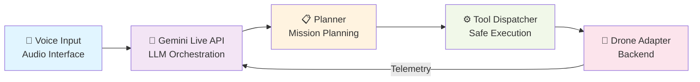

## 2. Tool Execution Pipeline (7-Step Flow)

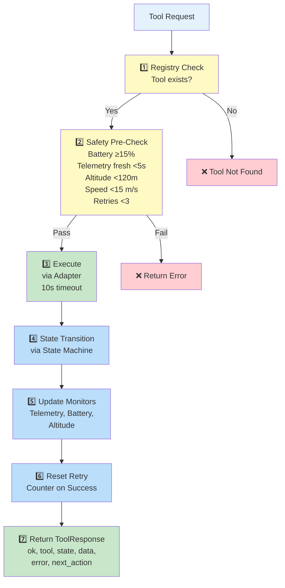

## 3. State Machine - All States & Transitions

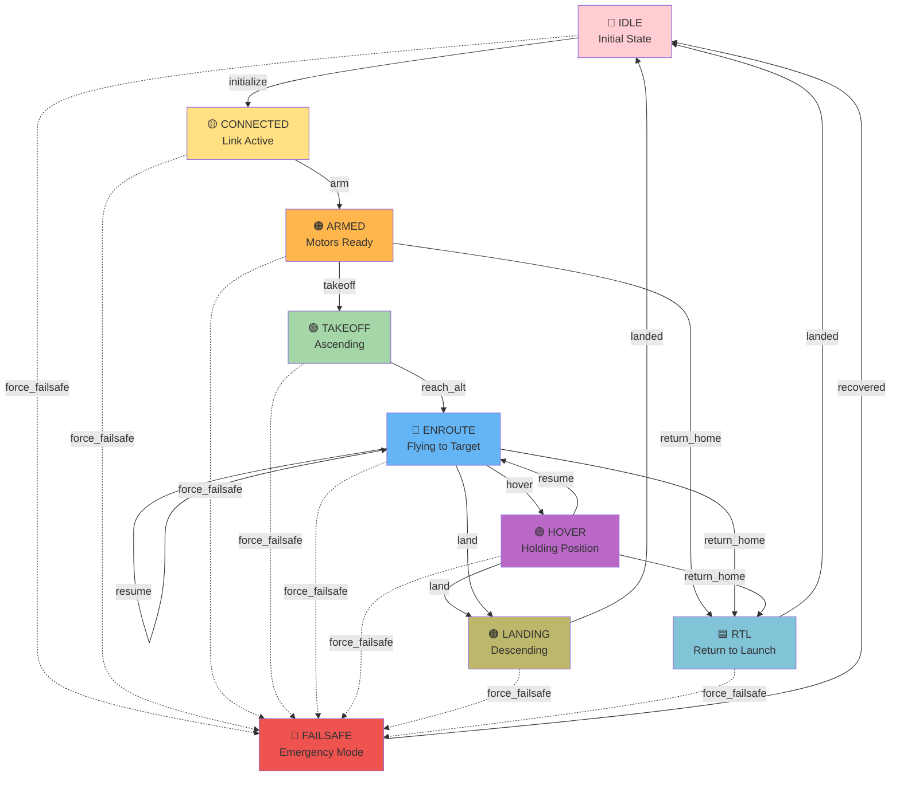

## 4. Background Subsystems - Async Task Architecture

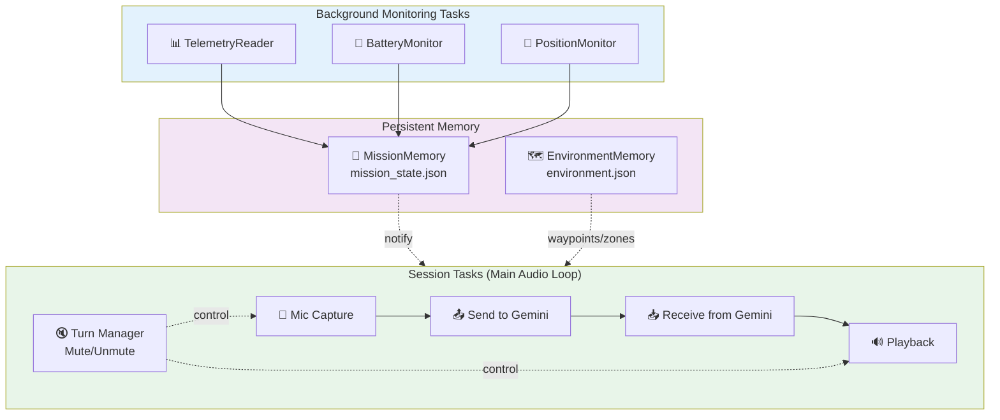

## 5. Planner Decision Engine - Outcomes

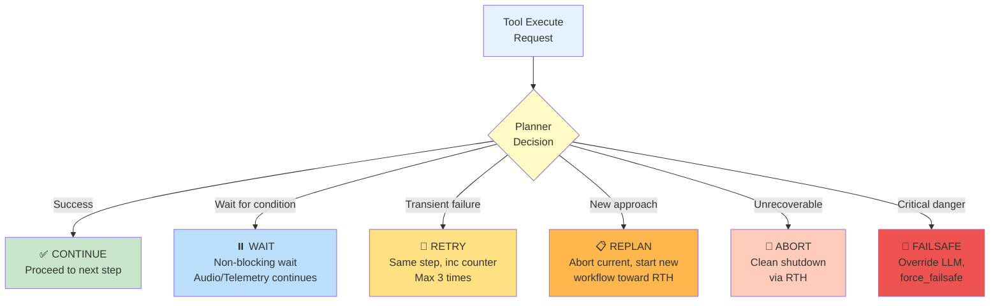

## 6. Safety Policy Gates - Pre-Execution Checks

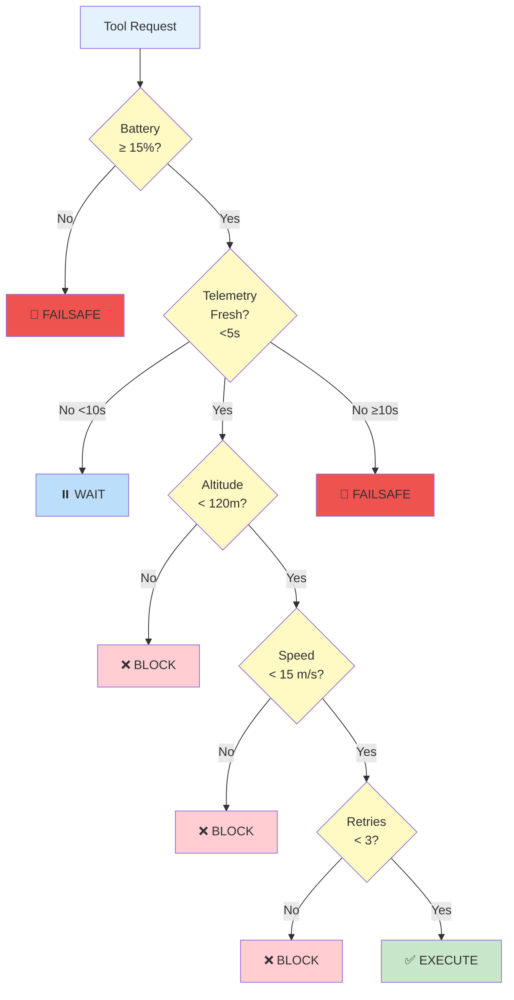

## 7. Workflow Execution Pattern

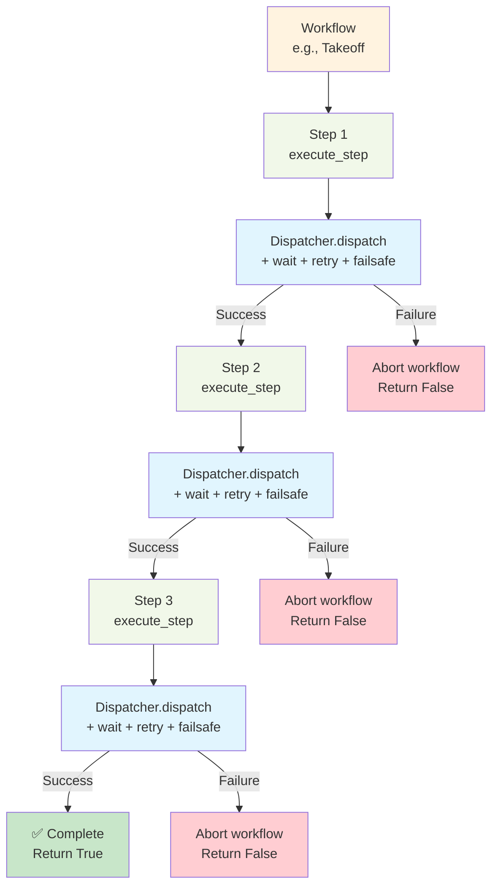

## 8. Drone Backend Abstraction

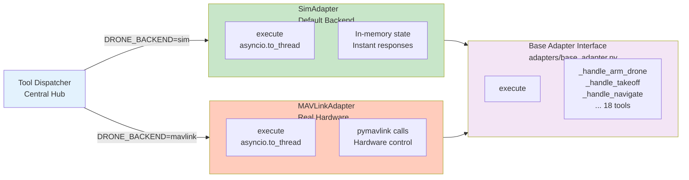

## 9. Complete System Architecture

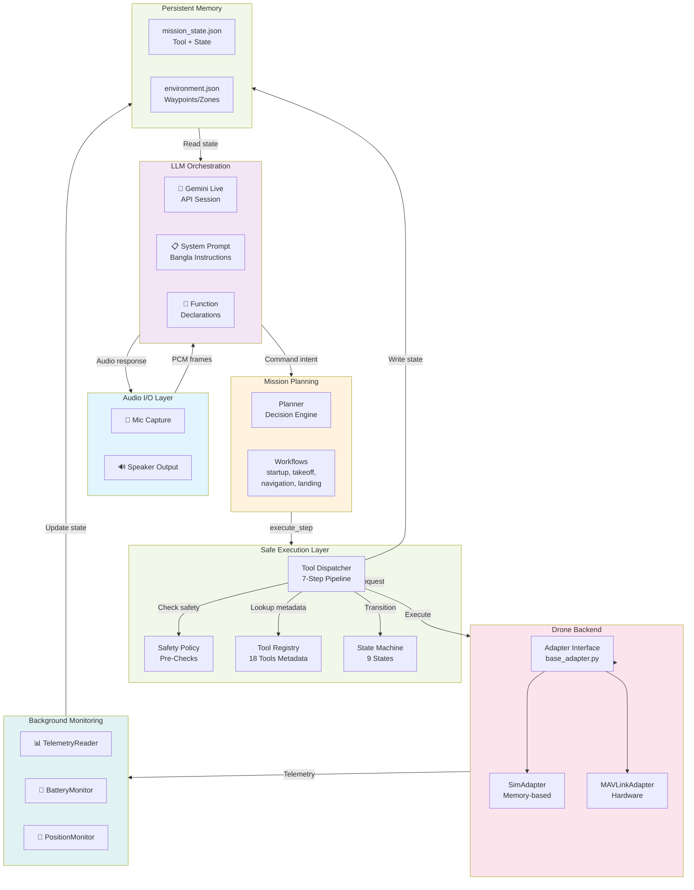

## 10. Tool Execution with Adapter Handler Contract

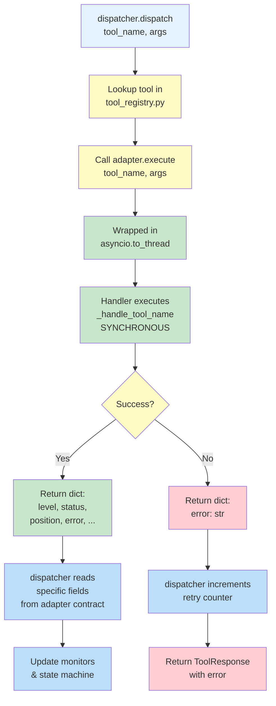

## 11. Voice Command Processing Flow

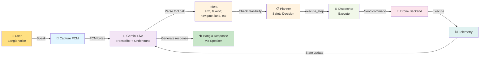

## Key Attributes

- **Async-First**: All subsystems run as isolated asyncio tasks
- **Fault Isolation**: Session crash doesn't kill telemetry; telemetry crash doesn't kill audio
- **Safety Override**: Planner has authority to override LLM decisions
- **Retryable**: Up to 3 automatic retries on transient failures
- **Swappable Backend**: Switch between sim and real drone via env var only
- **Persistent State**: Tool + mission state saved after every tool call
- **Non-Blocking Waits**: Audio/telemetry continue during motor spin-up, altitude stabilization
